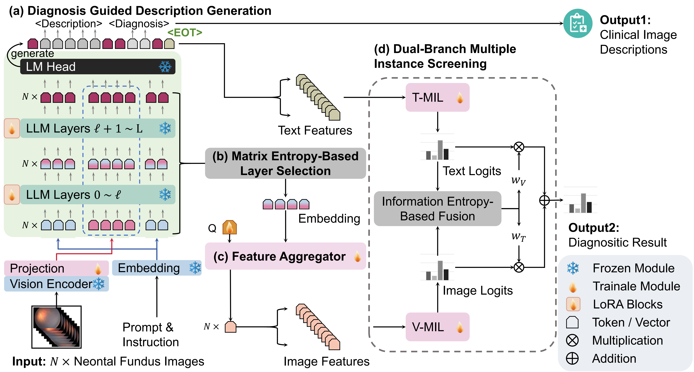
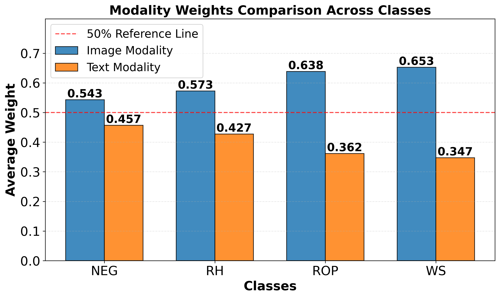

# GVL-MIL

> Generative Vision-Language Multiple Instance Learning for Weakly Supervised Neonatal Fundus Screening and Reporting

## Framework


## 1. Preparations
### 1.1 Virtual Environment
create conda environment and install packages. Since mil and vlm has dependecy conflicts, we need two virtual environments.

```bash
# to GVL-MIL
conda create -n llava python=3.10 -y
conda activate llava
bash env.sh
```
```bash
# for VLM training / inference
conda create -n mil python=3.10 -y
pip install -r requirements.txt
```
```bash
# for MIL training / inference
conda create -n mil python=3.10 -y
pip install -r requirements-mil.txt
```
### 1.2 Data Format
Description data: following llava, we use json list.
```json
[
    {
        "id": 1,
        "image": "path/to/image",
        "conversations": [
            {
                "from": "human",
                "value": "<image>\nPlease tell me the possible abnormality in the newborn fundus image in Chinese."
            },
            {
                "from": "gpt",
                "value": "<think>description</think> <answer>diagnosis</answer>."
            }
        ]
    },
    ...
]
```

Screening Data: bag-level json list.

```json
[
    {
        "id": 1,
        "num_image": 10,
        "patient": "patient1",
        "image": [
            "path/to/img1", 
            "path/to/img2",
            ...
        ],
        "label": "diagnosis",
    },
]
```


## 2. Train

### 2.1. LLaVA-OneVision
```bash
cd scripts
bash finetune_llava_valid_v2_desc_only.sh
```

### 2.2 MIL

Before start training MIL model, make sure you have customize constance (e.g., feature dimensions) in `mil/constants` and other arguments following the scripts.

To train single-brand MIL methods: 
```bash
python mil/main.py
```
To train GVL-MIL:
```bash
python mil/gvlmil_main.py
```

### 3. Results
